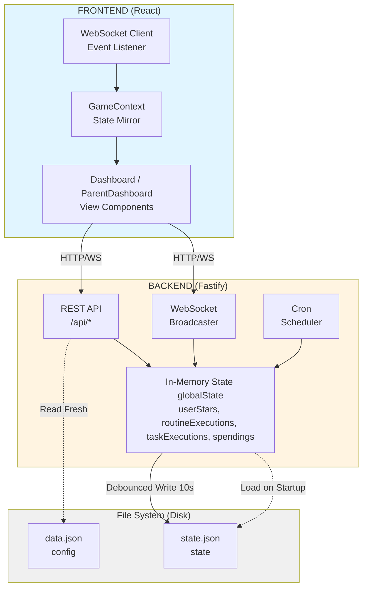

# Girls Gamified Routine - Technical Documentation

## Overview

**Girls Gamified Routine** is a real-time gamified task management system designed for children. The application features a fullscreen dashboard that displays scheduled routines (morning/evening tasks), awards stars for completion, and allows children to redeem rewards. Parents can manage the system through an admin interface.

### Core Technologies

- **Backend**: Node.js with Fastify, TypeScript, WebSockets, node-cron
- **Frontend**: React 19, Vite, TypeScript, Framer Motion, React Router
- **Infrastructure**: Docker Compose, Nginx (production proxy)
- **Data Persistence**: JSON files (file-based database)
- **Real-time Communication**: WebSockets for bidirectional state sync
- **Scheduling**: Cron expressions with timezone support (Europe/Athens default)

### Project Purpose

The system acts as a **real-time command center** for family routines:
- Routines automatically trigger at scheduled times (e.g., 7:00 AM morning routine)
- Multiple children can have routines running simultaneously (split-screen or grid view)
- Star rewards are awarded immediately upon task completion
- Parents monitor activity and approve reward redemptions
- PWA support allows installation on tablets/devices for kiosk-like experience

---

## Architecture Overview

### High-Level Data Flow



### The Three Data Layers

1. **Static Configuration (`data.json`)**
   - Users, routines, tasks, schedules, flows, rewards
   - Read fresh on every API request (allows hot-reloading)
   - Modified via Admin panel (`/parent` → Config tab)

2. **Dynamic State (`state.json`)**
   - User star balances, routine executions, task completions, spendings
   - Loaded into memory at startup (`globalState`)
   - Written to disk with 10-second debounce on changes
   - Atomic writes using temp file + rename pattern

3. **In-Memory Cache (`globalState`)**
   - Single source of truth during runtime
   - Merged with `data.json` on each read operation
   - Persisted to `state.json` asynchronously

---

## State Management Deep Dive

### Backend: File-Based Persistence

The backend uses a **hybrid caching strategy**:

```typescript
// In-memory state cache (server.ts)
let globalState: {
  userStars: Record<string, number>;
  routineExecutions: any[];
  taskExecutions: any[];
  spendings: Spending[];
}
```

**Read Flow** (`readDb()`):
1. Read `data.json` from disk (fresh every time)
2. Merge `globalState.userStars` into user objects
3. Append execution history and spendings from `globalState`
4. Return combined object

**Write Flow** (`writeDb()`):
1. Extract star balances from user objects → update `globalState.userStars`
2. Update execution/spending arrays in `globalState`
3. Schedule a debounced persist (10s delay)
4. On persist: atomic write to `state.json.tmp` → rename to `state.json`

**Why This Pattern?**
- **Hot reload config**: Parents can edit routines/schedules without restart
- **Performance**: In-memory reads are instant, writes are batched
- **Data integrity**: Atomic writes prevent corruption on crash
- **Separation of concerns**: Config changes don't corrupt runtime state

### Frontend: React Context + WebSocket Sync

The server is the source of truth and clients only render its state (`backend/src/sync.ts`, `frontend/src/context/GameContext.tsx`):

1. Every write to runtime state (`store.ts`) and every config change calls `sync.changed()`.
2. The server rebuilds the whole `AppState` (config, users with stars and routines, spendings, transfers, chores, exercises) and sends it to every client as a `STATE` message. Changes in one event-loop turn go out as one message, and builds never overlap, so the last message is always current.
3. A client that connects (or reconnects after a drop or a server restart) gets `STATE` the same way. `GameContext` replaces its state with each one; there is no REST fetch and no patching.

One-off effects are separate events and never the only carrier of state.

---

## Synchronization & Real-Time Communication

### WebSocket Messages (`ServerMessage` in `shared/types.ts`)

| Message | Payload | Purpose |
|---------|---------|---------|
| `STATE` | `AppState` | Everything clients render; on connect and after every change |
| `HEARTBEAT` | none | Every 10 s; a client that hears nothing for 25 s reconnects |
| `CHORE_CONFIRMED` / `CHORE_REJECTED` / `CHORE_EXPIRED` | `{ instanceId, choreId, choreTitle?, userId? }` | Toast on the kids' dashboard |

### Trigger Mechanisms

**1. Cron Scheduler** (`node-cron`)
```javascript
// Runs every minute (server.ts)
cron.schedule('* * * * *', () => {
  checkSchedules(new Date());
});
```

- Parses all schedules from `data.json`
- Compares cron expression against current time (timezone-aware)
- Calls `triggerAction(targetId)` for matching schedules
- Broadcasts appropriate WebSocket event

**2. Manual Push API** (`POST /api/hooks/push`)
```json
{ "id": "morning-flow" }
```
- Used by parent dashboard "Trigger" buttons
- Used by URL parameter (`?push=morning-flow`) for testing
- Simulates scheduled trigger immediately

**3. Flow Orchestration**
- Flows define multi-step sequences (`alarm` → `parallel routines`)
- Steps execute sequentially
- `parallel` steps trigger multiple routines simultaneously
- Frontend manages step progression via `handleStepComplete()`

---

## View Layer Architecture

### Routing Structure

```
/ (Root)
└─ Dashboard.tsx
   ├─ GlobalAlarm (overlay)
   ├─ InlineRoutinePlayer (1-4 simultaneous)
   └─ StoreModal (per-user reward shop)

/parent (Admin)
└─ parent/ParentDashboard.tsx
   ├─ Σήμερα: kids' balances, what waits for a parent
   ├─ Ιστορικό
   ├─ Ρυθμίσεις: rewards, schedules, chores (forms)
   └─ Προχωρημένα: JSON editors, uploads, log
```

### View Modes & Layouts

**Dashboard** dynamically adapts based on active routines:

| Active Count | Mode | Layout |
|--------------|------|--------|
| 0 | `IDLE` | Large clock + user dock at bottom |
| 1 | `SINGLE` | Fullscreen routine player |
| 2 | `DUAL` | 50/50 split (vertical on mobile) |
| 3+ | `GRID` | 2x2 grid |

**Responsive Breakpoints**:
- Desktop: Grid layout, large fonts
- Mobile (<768px): Single column, scaled-down timers

### Component Hierarchy

```
Dashboard
├─ GlobalAlarm (modal)
│  └─ Dismisses after user interaction
│
├─ InlineRoutinePlayer (per active user)
│  ├─ Header: Avatar, progress bar, exit button
│  ├─ Timeline: Dot indicators (past/current/future)
│  ├─ Task Display: Icon, title, countdown timer
│  ├─ "Done" Button: Advances to next task
│  └─ RewardOverlay (on completion)
│
└─ StoreModal (per user, on dock avatar click)
   ├─ Reward Grid: Available rewards with costs
   ├─ Pending List: Awaiting parent approval
   └─ History: Completed redemptions
```

### Task Lifecycle State Machine

```
[Routine Triggered] 
      ↓
[Task 1 Active] → Timer Counting → [User Clicks "Done"]
      ↓                                      ↓
   API Call: POST /api/executions/{id}/tasks/{taskId}/complete
      ↓                                      ↓
   Backend: times the task, awards stars, moves the RoutineRun on → STATE
      ↓                                      ↓
[Task 2 Active] → ... → [Last Task Done] (RoutineRun.finishedAt)
      ↓
[RewardOverlay Shown] → Auto-dismiss (5s) or Click → POST /api/executions/{id}/close
      ↓
[Routine closed] → the flow that started it moves on
```

---

## Critical Files Reference

### Backend

**`backend/src/server.ts`** (Core Server)
- **Lines 1-50**: Imports, file path setup, in-memory state declaration
- **Lines 51-90**: `loadState()`, `persistState()`, debounced save logic
- **Lines 92-140**: `readDb()`, `writeDb()` (hybrid data access)
- **Lines 142-180**: WebSocket connection management, `broadcast()` helper
- **Lines 182-230**: `triggerAction()` (dispatch routine/flow), `checkSchedules()` (cron logic)
- **Lines 232-280**: REST API routes (`/api/users`, `/api/flows`, `/api/rewards`, etc.)
- **Lines 282-320**: Task completion endpoint (star awards)
- **Lines 322-360**: Admin endpoints (upload, config editor, state editor)
- **Lines 362-380**: WebSocket route registration
- **Lines 382-400**: Startup sequence (load state, start cron, listen)

**`backend/data.json`** (Configuration Database)
- `tasks`: Task library (reusable across routines)
- `routines`: Template routines (Morning, Evening, etc.)
- `routineTasks`: Join table mapping routines → tasks with duration/order
- `users`: Children profiles with avatars and colors
- `routineAssignments`: User-specific routine instances (used as `routineId` in frontend)
- `flows`: Multi-step sequences (alarm → parallel routines)
- `schedules`: Cron expressions tied to flows or assignments
- `rewards`: Redeemable rewards with star costs
- `settings`: Global config (timezone)

**`backend/state.json`** (Dynamic State, auto-generated)
- `userStars`: `{ "u1": 120, "u2": 80 }`
- `routineExecutions`: Array of routine start records
- `taskExecutions`: Array of completed tasks
- `spendings`: Reward redemption history

### Frontend

**`frontend/src/context/GameContext.tsx`** (State Container)
- Holds the server's `AppState` (replaced by every `STATE` message), plus `isConnected` and `subscribe()` for events
- WebSocket client: reconnects on close; the server sends the state on connect
- Exported hook: `useGame()` for component access

**`frontend/src/api.ts`** (API Client)
- Thin wrappers around `fetch()` for all backend endpoints
- No state management (consumed by GameContext)

**`frontend/src/components/Dashboard.tsx`** (Main UI)
- Subscribes to server events via `useGame().subscribe()`
- Renders `flowRuns` (alarm steps) and `routineRuns` from the state; manages only UI state (`storeUserId`, drawers)
- Renders: Clock (idle), InlineRoutinePlayer (active), GlobalAlarm (flows), StoreModal

**`frontend/src/components/InlineRoutinePlayer.tsx`** (Routine UI)
- Props: `user`, `routine`, `executionId`, `onComplete`, `onExit`
- State: `currentTaskIndex`, `timeLeft`, `isActive`
- Calls `api.completeTask()` on each task finish
- Shows floating star animation on award

**`frontend/src/components/parent/`** (Admin UI)
- Views: Σήμερα (balances, star adjustments, pending purchases, gifts and chores), Ιστορικό, Ρυθμίσεις (forms for rewards, schedules, chores; start now), Προχωρημένα (JSON editors, uploads, log)
- Renders `useGame()` state; the JSON editors load on demand

### Shared

**`shared/types.ts`** (Type Contracts)
- Defines: `User`, `Routine`, `Task`, `Flow`, `Reward`, `Spending`
- Imported by both frontend and backend (`@shared` alias in Vite)
- Ensures type safety across network boundary

### Infrastructure

**`docker-compose.yml`** (Base Config)
- Defines: Service names (`backend`, `frontend`), network (`routine-net`), timezone

**`docker-compose.override.yml`** (Dev Mode - auto-loaded)
- Uses: `node:20-alpine` images, volume mounts for hot-reload
- Exposes: Backend on 3000, Frontend on 5173
- Command: `npm run dev` (nodemon for backend, Vite for frontend)

**`docker-compose.prod.yml`** (Production Mode - explicit)
- Builds: Dockerfiles for both services
- Frontend: Nginx serves static build, proxies API/WS to backend
- Backend: Compiled TypeScript (`npm run build`)
- Restart: Always (service auto-recovery)

**`frontend/nginx.conf`** (Production Proxy)
- Serves `/` from `/usr/share/nginx/html` (Vite build output)
- Proxies `/api` to `http://backend:3000`
- Proxies `/ws` with WebSocket upgrade headers

**`frontend/vite.config.ts`** (Build Config)
- Alias: `@shared` → `../shared`
- Proxy: `/api` and `/ws` to backend (dev mode only)
- PWA: Service worker with auto-update, manifest for installable app

---

## Flows and Routines on Screen (server state)

The server runs flows and routines (`db.ts`, "ROUTINES AND FLOWS ON SCREEN"); clients render them and report what the kids do. Both live in the database, so a reload or a server restart resumes them, and every device shows the same thing.

- **`FlowRun`** (`flow_runs`): a running flow, with its steps copied at start and the current `stepIndex`. An `alarm` step waits for `POST /api/flow-runs/:id/steps/:i/dismiss`. A `parallel` (or `routine`) step starts its routines and sub-flows and waits until they have all closed. After the last step the run ends, and the run that started it (`parentRunId`) moves on. Triggering a running flow restarts it.
- **`RoutineRun`** (`routine_runs`, one per user): the routine on screen, with `taskIndex` and `taskStartedAt` (every device counts down from the same start). `POST /api/executions/:id/tasks/:taskId/complete` times the task on the server, awards stars and moves to the next task; after the last one `finishedAt` is set and the reward shows until a client calls `POST /api/executions/:id/close` (✕ does the same).
- Every action names what it acts on (step index, task id), so two devices doing the same thing, or a double tap, changes nothing twice.

---

## I/O Patterns & Data Flow

### Initial Page Load

1. **Client** opens `/` → React app loads
2. **GameContext** mounts → opens the WebSocket
3. **Server** sends `STATE` (the whole `AppState`) on connect
4. **Dashboard** renders clock (idle mode)

### Scheduled Routine Trigger

1. **Cron** fires at 7:00 AM → `checkSchedules(new Date())`
2. **Server** finds schedule `sch-morning` → `triggerAction('morning-flow')`
3. **Server** creates the flow runs (the parallel step starts one sub-flow per kid, each at its alarm) → `STATE`
4. **All Clients** show a `GlobalAlarm` per kid; a dismissal moves that kid's flow on, which starts the routine → `STATE`
5. **Dashboard** switches to DUAL/GRID mode, renders `InlineRoutinePlayer` components

### Task Completion Flow

1. **User** clicks "Done" button in routine player
2. **Frontend** calls `api.completeTask(executionId, taskId)`
3. **Server** (`POST /api/executions/.../complete`), if `taskId` is the current task:
   - Times it from `taskStartedAt`, creates the `TaskExecution` record, awards the stars
   - Moves the `RoutineRun` to the next task (or sets `finishedAt`) → `STATE` to all clients
4. **All Clients** show the next task (or the reward); the tapping device animates the stars

### Reward Redemption Flow

1. **Child** clicks avatar in dock → Opens `StoreModal`
2. **Child** clicks reward → Calls `api.spendStars(userId, rewardId)`
3. **Server** (`POST /api/spendings`):
   - Validates: `user.stars >= reward.cost`
   - Deducts stars, creates `Spending` record (status: `pending`)
   - Writes to the database; the store change sends `STATE` to all clients
4. **All Clients** show the new balance and the pending spending
5. **Parent** opens `/parent` → Sees pending spending
6. **Parent** clicks "Done" → Calls `api.markSpendingDone(id)` → Status changes to `done`

---

## Deployment & Environment

### Development Mode

```powershell
docker-compose up
```

- **Hot Reload**: File changes in `backend/`, `frontend/`, `shared/` trigger auto-rebuild
- **File Watching**: Uses `CHOKIDAR_USEPOLLING=true` for Docker volume compatibility
- **Ports**: Frontend (5173), Backend (3000)
- **Data Persistence**: `backend/data.json` and `backend/state.json` mounted as volumes

### Production Mode

```powershell
docker-compose -f docker-compose.yml -f docker-compose.prod.yml up --build
```

- **Optimized Builds**: TypeScript compiled, Vite production bundle
- **Single Port**: Frontend Nginx on port 80 (proxies backend internally)
- **Data Volume**: `./backend:/data` ensures state persists across container restarts
- **Restart Policy**: `always` (auto-restart on failure or reboot)

### Raspberry Pi 4 Deployment

Fully supported on ARM64 architecture:
- Base images (`node:20-alpine`, `nginx:alpine`) support ARM64
- Production mode recommended (dev file-watching consumes excessive CPU)
- First build takes 5-10 minutes, subsequent starts are instant
- Minimum 2GB RAM recommended

### Environment Variables

| Variable | Default | Purpose |
|----------|---------|---------|
| `DATA_FILE` | `./data.json` | Path to config file (prod: `/data/data.json`) |
| `STATE_FILE` | `./state.json` | Path to state file (prod: `/data/state.json`) |
| `TZ` | `Europe/Athens` | Container timezone for cron accuracy |
| `CHOKIDAR_USEPOLLING` | `true` (dev) | Enable file-watching in Docker volumes |

---

## Practices & Patterns Employed

### 1. **Shared Type System**
- **Pattern**: Monorepo with `shared/types.ts` imported by both frontend and backend
- **Benefit**: Type safety across network boundary, single source of truth for data models
- **Implementation**: Vite alias (`@shared`) resolves to `../shared`

### 2. **Debounced Persistence**
- **Pattern**: In-memory cache with delayed disk writes (10s debounce)
- **Benefit**: Protects against write storms, improves performance
- **Implementation**: `setTimeout` cleared and reset on each state change

### 3. **Atomic File Writes**
- **Pattern**: Write to `.tmp` file, rename to target (atomic operation)
- **Benefit**: Prevents corruption if process crashes mid-write
- **Implementation**: `fs.rename()` after successful write

### 4. **WebSocket Event Broadcasting**
- **Pattern**: Single broadcast function iterates all connected clients
- **Benefit**: Decouples event sources from clients, real-time updates
- **Implementation**: `Set<WebSocket>` with readyState check

### 5. **Cron-Based Scheduling**
- **Pattern**: `node-cron` with timezone-aware parsing via `cron-parser` + `luxon`
- **Benefit**: Accurate scheduling regardless of server timezone
- **Implementation**: `cron-parser` with `tz` option, minute-level granularity

### 6. **Hot-Reloadable Configuration**
- **Pattern**: Read `data.json` fresh on every API request
- **Benefit**: Parents can edit config without server restart
- **Implementation**: `readDb()` always hits disk for config, merges with memory state

### 7. **Progressive Web App (PWA)**
- **Pattern**: Vite PWA plugin with auto-update strategy
- **Benefit**: Installable on tablets, offline support, app-like experience
- **Implementation**: Service worker caches assets, manifest defines icons/theme

### 8. **Proxy Pattern for API**
- **Pattern**: Nginx (prod) and Vite (dev) proxy `/api` and `/ws` to backend
- **Benefit**: Single origin, no CORS issues, simplified deployment
- **Implementation**: Nginx `proxy_pass`, Vite `server.proxy`

### 9. **Component Composition**
- **Pattern**: Smart container (Dashboard) + dumb presenters (InlineRoutinePlayer)
- **Benefit**: Reusable components, clear separation of concerns
- **Implementation**: Props for data, callbacks for actions

### 10. **Server-Driven State**
- **Pattern**: Clients never patch state; they render the latest `STATE` from the server
- **Benefit**: Every view converges, including after reconnects and restarts
- **Implementation**: `backend/src/sync.ts` + `GameContext.tsx`

---

## Assessment & Improvement Roadmap

### Current Strengths

✅ **Real-time synchronization** works reliably with WebSocket broadcasting  
✅ **Type safety** across frontend/backend with shared types  
✅ **Hot-reloadable config** allows live changes without downtime  
✅ **Debounced persistence** prevents write storms and improves performance  
✅ **Timezone-aware scheduling** ensures accurate routine triggers  
✅ **PWA support** enables tablet installation for dedicated use  
✅ **Docker Compose** simplifies dev/prod environments  
✅ **Atomic file writes** protect against data corruption  

### Critical TODOs (Security & Stability)

#### 🔴 **Priority 1: Authentication & Authorization**
**Issue**: Admin endpoints (`/api/admin/*`, `/parent`) are completely open  
**Risk**: Anyone can read/write config, view state, upload files  
**Solution**:
- Implement simple PIN-based auth for `/parent` route
- Add middleware to check auth token on admin endpoints
- Store hashed PIN in environment variable
```typescript
// Example: Add to server.ts
const ADMIN_PIN = process.env.ADMIN_PIN || '1234';
server.addHook('preHandler', (request, reply, done) => {
  if (request.url.startsWith('/api/admin')) {
    const pin = request.headers['x-admin-pin'];
    if (pin !== ADMIN_PIN) {
      reply.code(401).send({ error: 'Unauthorized' });
      return;
    }
  }
  done();
});
```

#### 🔴 **Priority 2: Input Validation**
**Issue**: API endpoints trust all input (user IDs, task IDs, JSON in POST body)  
**Risk**: Malformed data can crash server or corrupt state  
**Solution**:
- Add JSON schema validation with `@fastify/ajv`
- Validate UUIDs, dates, numbers at endpoint entry
- Reject unknown properties in POST bodies

#### 🟡 **Priority 3: File Upload Security**
**Issue**: `/api/admin/upload` accepts any file, stores with timestamp-only filename  
**Risk**: Malicious files (scripts, executables), filename collisions  
**Solution**:
- Whitelist MIME types (image/png, image/jpeg, image/svg+xml)
- Validate file size (max 5MB)
- Use UUIDs for filenames, store original name in metadata

### Code Quality Improvements

#### 🟡 **Remove `any` Types**
**Files**: `server.ts` (lines with `any[]`, `any` parameters)  
**Solution**: Define proper interfaces for `RoutineExecution`, `TaskExecution`, `RoutineAssignment`

#### 🟡 **Migrate `verify_api.js` to TypeScript**
**Issue**: Single JavaScript file in TypeScript project  
**Solution**: Rename to `.ts`, add types, or delete if unused

#### 🟡 **Standardize Error Handling**
**Issue**: Inconsistent error responses (some `reply.code(500)`, some throw)  
**Solution**: Add global error handler in Fastify, return consistent JSON structure

#### 🟡 **Frontend Error Boundaries**
**Issue**: Component errors crash entire app  
**Solution**: Add React Error Boundary around Dashboard and ParentDashboard

### Architectural Upgrades

#### 🟢 **Database Migration**
**Current**: JSON files (`data.json`, `state.json`)  
**Limitation**: No transactions, poor concurrency, manual relationship management  
**Recommendation**: Migrate to **SQLite** (lightweight, serverless, perfect for this scale)  
**Migration Path**:
1. Install `better-sqlite3`
2. Create schema matching current JSON structure
3. Write migration script to import existing data
4. Update `readDb()`/`writeDb()` to use SQL queries
5. Keep JSON as backup/export format

#### 🟢 **Logging & Observability**
**Current**: Console logs only  
**Recommendation**: Add structured logging with `pino` (Fastify's logger)  
**Add**:
- Request/response logging (already available via Fastify logger)
- Business event logging (routine starts, star awards, redemptions)
- Error tracking (consider Sentry for production)

#### 🟢 **Testing**
**Current**: No automated tests  
**Recommendation**:
- **Unit**: Backend API endpoints (Fastify testing utilities)
- **Integration**: WebSocket event flow, cron trigger logic
- **E2E**: Playwright tests for Dashboard user flows
**Priority Routes**:
- `POST /api/executions/.../complete` (star award logic)
- `checkSchedules()` function (cron accuracy)
- WebSocket reconnection behavior

#### 🟢 **State Management Enhancement**
**Current**: Context API holding the server's `AppState`  
**Limitation**: Difficult to debug, no time-travel, no middleware  
**Recommendation** (only if complexity grows):
- Consider Zustand (lightweight, TypeScript-friendly, dev tools)
- Keep Context API for now (good enough for current scale)

### UX & Feature Enhancements

#### 🟢 **Offline Support**
**Current**: PWA caches assets but requires backend for state  
**Enhancement**: Add IndexedDB cache for offline star viewing, queue redemptions

#### 🟢 **Undo/Revoke Task Completion**
**Current**: No way to undo accidental task completion  
**Enhancement**: Add "Undo" button with 5-second window, or parent admin tool to revoke

#### 🟢 **Historical Analytics**
**Current**: `taskExecutions` and `routineExecutions` stored but not visualized  
**Enhancement**: Add charts to `/parent` showing completion rates, on-time %, trends

#### 🟢 **Sound Management**
**Current**: Alarm sound is hardcoded (`melody`)  
**Enhancement**: Add sound upload to admin panel, per-flow sound selection

### Documentation TODOs

#### 📝 **API Documentation**
**Missing**: OpenAPI/Swagger spec for REST endpoints  
**Solution**: Add `@fastify/swagger` plugin, generate docs at `/docs`

#### 📝 **Deployment Guide**
**Missing**: Production deployment checklist (backups, monitoring, SSL)  
**Solution**: Add `DEPLOYMENT.md` with systemd service, Caddy/Traefik SSL setup, backup scripts

#### 📝 **Contributing Guide**
**Missing**: Developer onboarding (local setup, commit conventions, PR process)  
**Solution**: Add `CONTRIBUTING.md` with VSCode setup, Docker troubleshooting

---

## Quick Reference for New Developers

### Adding a New Routine
1. Edit `backend/data.json` → Add entry to `routines` array
2. Add tasks to `routineTasks` with `routineId` reference
3. Create `routineAssignment` linking user to routine
4. (Optional) Add schedule entry to trigger automatically
5. Restart backend or use hot-reload (save `data.json`)

### Adding a New Reward
1. Edit `backend/data.json` → Add entry to `rewards` array
2. Frontend will automatically display in StoreModal
3. Upload icon via `/parent` → Uploads section if using custom image

### Changing a Schedule Time
1. Edit `backend/data.json` → Find schedule in `schedules` array
2. Update `cron` field (format: `minute hour * * *` for daily)
3. Save file (hot-reload applies immediately)

### Debugging WebSocket Issues
1. Open browser DevTools → Network tab → Filter by WS
2. Check connection status (should show `/ws` with green indicator)
3. View sent/received messages in Frames tab
4. Check backend logs for `Client connected via WebSocket`
5. Common issue: NGINX proxy missing `Upgrade` headers (check `nginx.conf`)

### Testing a Routine Manually
1. Open `/parent` dashboard
2. Scroll to "Trigger Routines" section
3. Click button for desired routine/flow
4. Watch frontend for immediate response
5. Or use URL parameter: `/?push=morning-flow`

### Viewing Raw State
1. Open `/parent` → State tab
2. View current `userStars`, `routineExecutions`, etc.
3. Edit JSON (be careful!) and click Save
4. Or directly edit `backend/state.json` (requires server restart)

### Backup & Restore
**Backup**:
```powershell
# Copy state files
cp backend/data.json backup/data-$(date +%Y%m%d).json
cp backend/state.json backup/state-$(date +%Y%m%d).json
```

**Restore**:
```powershell
# Replace current files
cp backup/data-20250101.json backend/data.json
cp backup/state-20250101.json backend/state.json
# Restart backend
docker-compose restart backend
```

---

## Conclusion

This project demonstrates a **real-time, event-driven architecture** suitable for small-scale interactive applications. The file-based persistence is pragmatic for the current scope (2-4 users, low write frequency), and the WebSocket synchronization provides instant feedback crucial for engaging children.

**For new developers**: Start by understanding the data flow (REST → WebSocket → Component), then explore the scheduling logic (`checkSchedules()`), and finally dive into the component lifecycle (`InlineRoutinePlayer`). The codebase is well-structured with clear separation between backend (source of truth) and frontend (reactive view).

**For production use**: Prioritize authentication, input validation, and regular backups. The system is stable for family use but requires hardening for public deployment.

---

*Last Updated: November 22, 2025*  
*Repository: girls_gamiefied_routine*  
*Stack: Node.js + Fastify + React + WebSockets + Docker*
